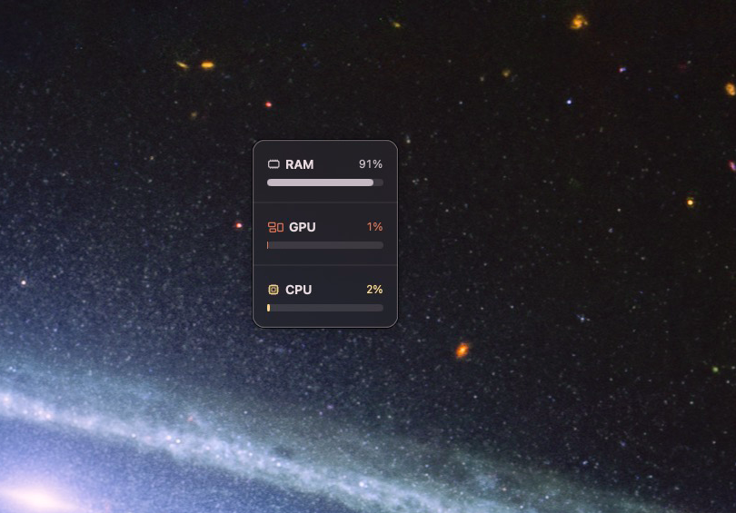
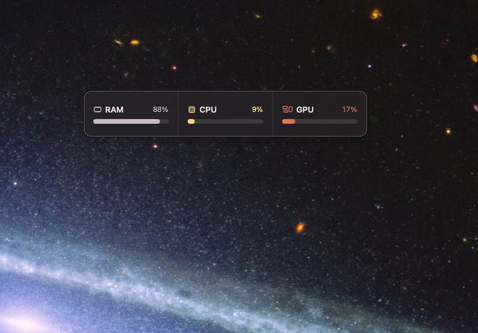
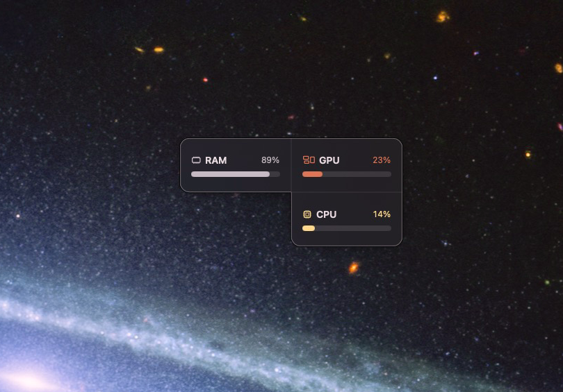
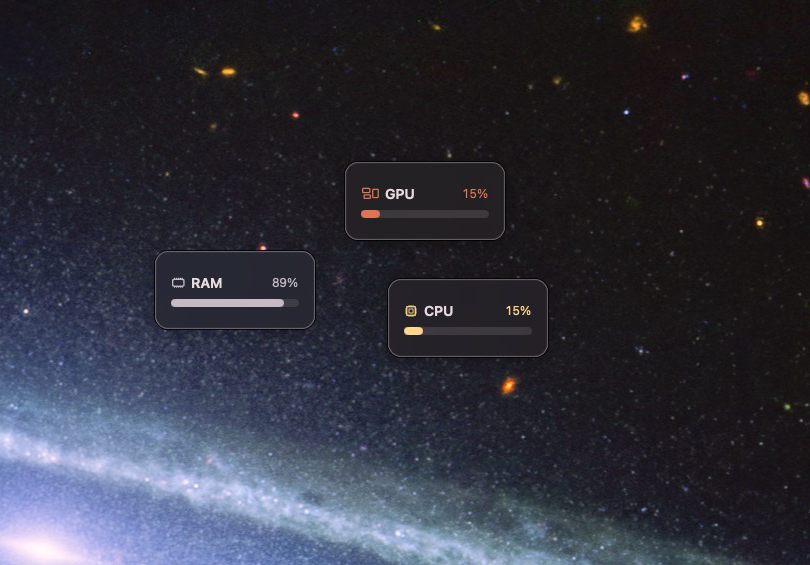

# potatus hub

> **Long-press a module and drag to detach just that module from a group.**

`potatus hub` is a small, local-first system monitor for Apple Silicon Macs and Windows 11. It keeps RAM, CPU, and GPU usage visible as calm, movable modules. Show only the metrics you want, arrange them freely, and let nearby modules merge into one surface.

## Highlights

- Apple Silicon RAM, CPU, and GPU utilization
- Windows 11 x64 RAM, CPU, and GPU utilization
- Minimal menu-bar icon with no Dock icon
- Independent RAM, CPU, and GPU modules — show or hide each one
- Magnetic merging: modules snap into horizontal, vertical, or L-shaped groups
- Smooth, soft merge, split, show, and hide animations
- Double-click a grouped module to switch between horizontal and vertical layouts
- Save module positions and restore them on the next launch
- Refresh from the tray or a module context menu
- Korean, English, Japanese, and Chinese interface support
- Optional launch at login
- No account, analytics, cloud sync, or network service

## Screenshots

| Vertical group | Horizontal group |
| --- | --- |
|  |  |

| L-shaped group | Detached modules |
| --- | --- |
|  |  |

## Requirements

- macOS 13 Ventura or later on Apple Silicon
- or Windows 11 x64

GPU reporting uses the locally available Apple GPU utilization record. If macOS does not provide a value, the module shows `—` rather than an invented percentage.

## Download and install

Download the latest build from [GitHub Releases](../../releases/latest).

| Platform | Download |
| --- | --- |
| macOS 13+ Apple Silicon | [`potatus-hub-0.4.1-macOS-arm64.zip`](https://github.com/bmminky/potatus-hub/releases/download/v0.4.1/potatus-hub-0.4.1-macOS-arm64.zip) |
| Windows 11 x64 | [`potatus-hub-0.4.1-windows-x64.zip`](https://github.com/bmminky/potatus-hub/releases/download/v0.4.1/potatus-hub-0.4.1-windows-x64.zip) |

SHA-256:

```text
e603dda206791c57ef274b9c96fef089b95fdec611b8ff33b3a5c93a1e2e36d1  potatus-hub-0.4.1-macOS-arm64.zip
db16dfeaccb364d117bb7b5e07f169e13ad5d92d98fe334484a985396a2dd493  potatus-hub-0.4.1-windows-x64.zip
```

### macOS

1. Unzip `potatus-hub-*-macOS-arm64.zip`.
2. Move `potatus hub.app` to `/Applications`.
3. On the first launch, Control-click the app in Finder and choose **Open**.
4. Look for the icon in the macOS menu bar.

The release build uses an ad-hoc signature and is not notarized. macOS may show a first-launch warning. Only override that warning after confirming the archive came from this repository.

### Windows 11

1. Download and unzip `potatus-hub-*-windows-x64.zip`.
2. Run `potatus hub.exe`.
3. Look for the icon in the Windows notification area.

The Windows build is self-contained, so a separate .NET installation is not required. The executable is currently unsigned; Windows SmartScreen may show a first-launch warning.

## Build from source

```bash
swift build
./Scripts/build-app.sh
open ".build/potatus hub.app"
```

Build the Windows app on Windows 11 with .NET 8:

```powershell
dotnet publish windows/PotatusHub/PotatusHub.csproj `
  -c Release -r win-x64 --self-contained true `
  -p:PublishSingleFile=true
```

## Privacy

All measurements are collected locally from macOS. `potatus hub` does not use an account, analytics, cloud sync, or a remote monitoring service.

---

## 한국어

> **길게 누른 뒤 드래그하면 선택한 모듈만 다시 분리할 수 있습니다.**

Apple Silicon Mac 및 Windows 11용 로컬 시스템 모니터입니다. RAM·CPU·GPU 사용률을 독립 모듈로 표시합니다. 필요한 항목만 켜고, 가까이 놓은 모듈은 가로·세로·ㄴ자 형태로 자연스럽게 결합됩니다.

- 메뉴바 아이콘만 표시하는 가벼운 구성
- RAM·CPU는 1초, GPU는 2초 간격으로 갱신
- 모듈 표시 여부, 정렬, 분리, 언어, 로그인 시 실행 설정
- 모듈 위치 자동 복원
- 계정·분석·클라우드 동기화·원격 서비스 없음

지원 환경은 **macOS 13 Ventura 이상 / Apple Silicon Mac** 또는 **Windows 11 x64**입니다.
